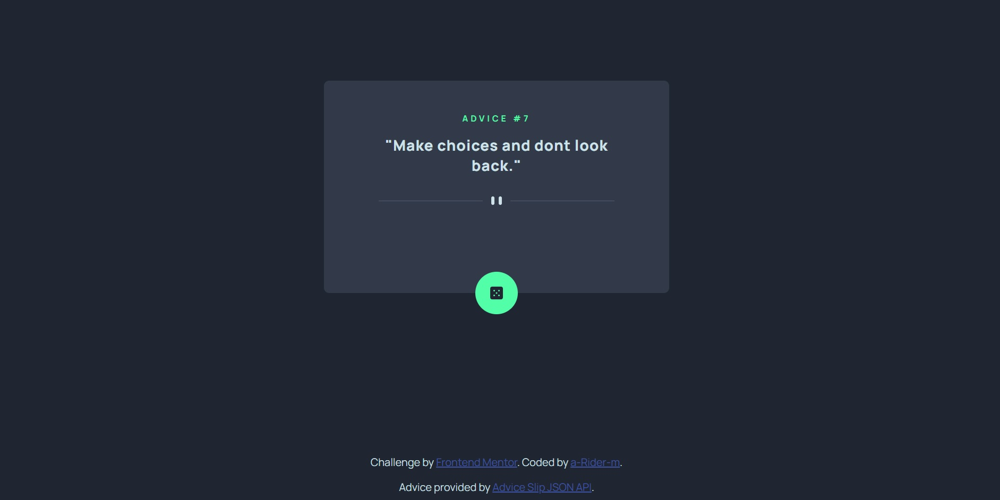
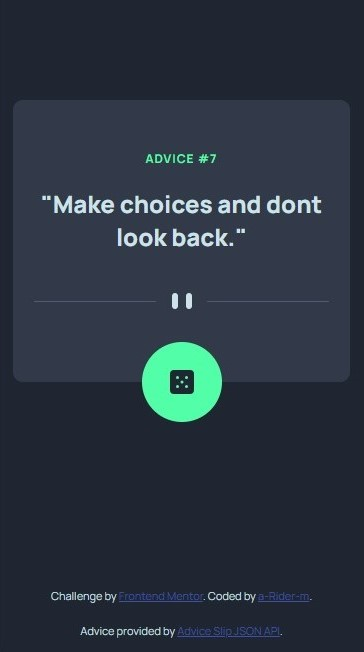
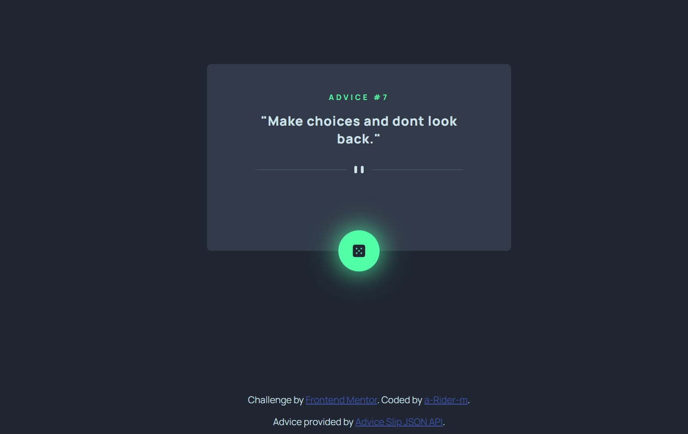

# Frontend Mentor - Advice generator app solution

This is a solution to the [Advice generator app challenge on Frontend Mentor](https://www.frontendmentor.io/challenges/advice-generator-app-QdUG-13db).

## Table of contents

- [Overview](#overview)
  - [The challenge](#the-challenge)
  - [Screenshot](#screenshot)
  - [Links](#links)
- [My process](#my-process)
  - [Built with](#built-with)
  - [What I learned](#what-i-learned)
- [Author](#author)

## Overview

### The challenge

Users should be able to:

- View the optimal layout for the app depending on their device's screen size
- See hover states for all interactive elements on the page
- Generate a new piece of advice by clicking the dice icon

### Screenshots

-Desktop


-Mobile


-Active states


### Links

- Solution URL: [https://github.com/a-Rider-m/advice-generator](https://github.com/a-Rider-m/advice-generator)
- Live Site URL: [https://a-rider-m.github.io/advice-generator/](https://a-rider-m.github.io/advice-generator/)

## My process

### Built with

- Semantic HTML5 markup
- CSS custom properties
- Flexbox
- CSS Grid
- Mobile-first workflow
- JS vanilla

### What I learned

During this project, I practiced the use of asynchronous functions in JavaScript and API Rest

```js
async function fetchData(url) {
    const response = await fetch(url)
    const data = await response.json();

    return data;
};

async function randomAdvice() {
    const data = await fetchData(URL);

    adviceId.innerText = `ADVICE #${data.slip.id}`;
    adviceContainer.innerText = `"${data.slip.advice}"`;
};
```

## Author

- Frontend Mentor - [@a-Rider-m](https://www.frontendmentor.io/profile/yourusername)
- Github - [a-Rider-m](https://github.com/a-Rider-m)